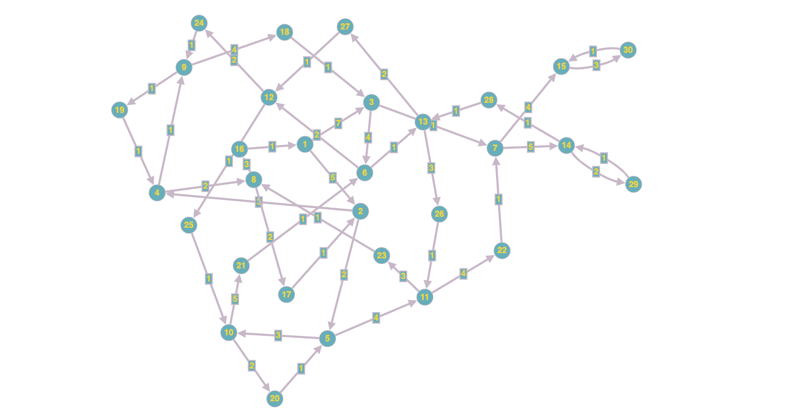

# Bellman-Ford Algorithm

## Overview

This project implements the Bellman-Ford algorithm in C to find the shortest paths from a source vertex to all other vertices in a weighted directed graph. The repository includes the algorithm's visual representation, a sample graph matrix, the main C program (`main.c`), and an image of the graph.

## Files

1. **Algorithm Visualization:**
   - 

2. **Graph Representation:**
   - **Graph Matrix (gr.txt):**
     - A text file containing a matrix that represents the weighted directed graph.

3. **C Program:**
   - **main.c:**
     - The main C program that implements the Bellman-Ford algorithm.
     - Dependencies: `stdio.h`, `stdlib.h`, `limits.h`

4. **Graph Image:**
   - 
     - A visual representation of the graph.

## How to Run

To execute the program, use the following command in your terminal:

```bash
./executable_name option
```

Replace `executable_name` with the name of the compiled executable. The `option` parameter specifies how the graph data is provided:

- Option 1: Graph data is hardcoded in the program.
- Option 2: User inputs the graph matrix during runtime.
- Option 3: Graph data is read from a text file.

### Example Usage

1. Option 1:
   ```bash
   ./executable_name 1
   ```

2. Option 2:
   ```bash
   ./executable_name 2
   ```

3. Option 3:
   ```bash
   ./executable_name 3 input_filename.txt
   ```

## Sample Graph

The provided C program includes a sample graph with default values. You can modify the code or choose other options to input your own graph data.

## Note

Ensure that the necessary dependencies are installed, and the C program is compiled before running. Use a C compiler, such as `gcc`, to compile the program.

Feel free to explore, modify, and integrate this Bellman-Ford algorithm implementation into your projects!
